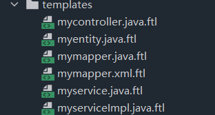

# second kill
简单的秒杀系统


---


### 环境搭建

```xml
<!--mybatis-plus 依赖-->
<dependency>
    <groupId>com.baomidou</groupId>
    <artifactId>mybatis-plus-boot-starter</artifactId>
    <version>3.4.0</version>
</dependency>

<!--thymeleaf模板引擎-->
<dependency>
    <groupId>org.springframework.boot</groupId>
    <artifactId>spring-boot-starter-thymeleaf</artifactId>
</dependency>

<!--web组件-->
<dependency>
    <groupId>org.springframework.boot</groupId>
    <artifactId>spring-boot-starter-web</artifactId>
</dependency>

<!--开发工具-->
<dependency>
    <groupId>org.springframework.boot</groupId>
    <artifactId>spring-boot-devtools</artifactId>
    <scope>runtime</scope>
    <optional>true</optional>
</dependency>

<!--mysql组件-->
<dependency>
    <groupId>mysql</groupId>
    <artifactId>mysql-connector-java</artifactId>
    <scope>runtime</scope>
</dependency>

<!--lombok-->
<dependency>
    <groupId>org.projectlombok</groupId>
    <artifactId>lombok</artifactId>
    <optional>true</optional>
</dependency>

<!--test组件-->
<dependency>
    <groupId>org.springframework.boot</groupId>
    <artifactId>spring-boot-starter-test</artifactId>
    <scope>test</scope>
</dependency>
```

配置文件

```yaml
spring:
  # thymeleaf配置
  thymeleaf:
    # 关闭缓存
    cache: false
  # 数据源配置
  datasource:
    driver-class-name: com.mysql.cj.jdbc.Driver
    url: jdbc:mysql://localhost:3306/ms?useUnicode=true&characterEncoding=UTF-8&serverTimeZone=Asia/Shanghai
    username: root
    password: 123
    hikari:
      # 连接自动提交
      auto-commit: true
      # 连接池名
      pool-name: DataHikariCP
      # 最大连接数，默认 10
      maximum-pool-size: 10
      # 最小空闲连接数
      minimum-idle: 5
      # 空闲连接最大存活时间，默认是 600000ms（10min）。这里设置 30min
      idle-timeout: 1800000
      # 连接最大存活时间，0表示永久存活，默认 1800000ms，即 30min
      max-lifetime: 1800000
      # 连接超时时间，默认 30000ms，即 30秒
      connection-timeout: 30000
      # 测试连接是否可用的查询语句
      connection-test-query: SELECT 1

# mybatis-plus配置
mybatis-plus:
  # 默认 private String[] mapperLocations = new String[]{"classpath*:/mapper/**/*.xml"};
  mapper-locations: classpath*:/mapper/*Mapper.xml
  # 配置mybatis数据返回类型别名（默认别名是类名）
  type-aliases-package: com.engure.seckill.pojo

# 日志打印
logging:
  level:
    # sql打印，是 mapper 接口所在的包
    com.engure.seckill.mapper: debug
```


### 登录功能


#### **两次MD5加密**

1. 用户端：pass = md5 (明文 + ==固定salt==)            ===>      防止密码在明文中传输
2. 服务端：pass = md5 (用户输入 + ==随机salt==)    ====>    提高密码安全性，`双重保险`


- 为什么不把前端传给后端的密码直接存入数据库？而是再进行一次加密？

  `md5加密安全性不高，即使使用了盐。防止万一数据库被盗用之后，使用 password+salt 两个字段反推出明文。所以再存入数据库之前再进行一次加密。`


> 参考：登陆密码两次MD5加密设计 https://blog.csdn.net/potatobeancox55555/article/details/80586743
>
> **整体流程**
>
> 1. MD5(MD5(pass明文+固定salt)+随机salt)
> 2. 第一次固定salt写死在前端
> 3. 第二次加密采用随机的salt 并将每次生成的salt保存在数据库中
>
> **登录流程**
>
> 1. 前端对用户输入的密码进行md5加密（固定的salt）
> 2. 将加密后的密码传递到后端
> 3. 后端使用用户id取出用户信息
> 4. 后端对加密后的密码在进行md5加密（取出盐），然后与数据库中存储的密码进行对比，
> 5. ok登录成功，否则登录失败
>
> **注册流程**
>
> 1. 前端对用户输入的密码进行md5加密（固定的salt）
> 2. 将加密后的密码传递到后端
> 3. 后端随机生成一个salt
> 4. 使用生成salt对前端传过来的密码进行加密，然后将加密后密码和salt一起保存到db中


引入依赖：

```xml
<!--md5 依赖-->
<dependency>
    <groupId>commons-codec</groupId>
    <artifactId>commons-codec</artifactId>
</dependency>
<dependency>
    <groupId>org.apache.commons</groupId>
    <artifactId>commons-lang3</artifactId>
</dependency>
```

创建工具类：

```java
@Component
public class MD5Util {

    // 通用方法
    public static String md5(String src) {
        return DigestUtils.md5Hex(src);//apache包下
    }

    /*************************************************************************************/

    //前端的盐（较为固定）
    private static final String salt = "!qwq**#$#-tk1$9&&7";

    /**
     * 第一次加密，密码框 到 提交的表单（前端）
     */
    public static String inputToForm(String in) {
        //混淆
        String complexStr = salt.charAt(3) + salt.charAt(8) +
                in + salt.charAt(0) + salt.charAt(9);
        return md5(complexStr);
    }

    /*************************************************************************************/

    /**
     * 后端，第二次加密，表单 到 数据库
     * @param formPass 表单密码，从请求中得到的密码，是前端加密后的结果
     * @param salt 【后端生成的随机盐】！！最终存放到数据库中
     * @return
     */
    public static String formToDb(String formPass, String salt) {
        String complexStr = salt.charAt(1) + salt.charAt(6) +
                formPass + salt.charAt(6) + salt.charAt(10);
        return md5(complexStr);
    }

}
```


**创建用户表**

```sql
create table t_user(
	`id` bigint(20) not null comment '用户id，手机号码',
	`nickname` varchar(255) not null,
	`password` varchar(32) default null comment 'md5( md5(pass明文+固定salt) + salt )',
	`salt` varchar(10) default null,
	`avator` varchar(128) default null comment '头像',
	`register_date` datetime default null comment '注册时间',
	`last_login_date` datetime default null comment '最后一次登录时间',
	`login_count` int(11) default '0' comment '登陆次数',
	primary key(`id`)
);
```


#### **逆向工程**

mybatis 中的 MBG 逆向工程只能生成 pojo, mapper, mapper.xml

mybatis-plus 是增强版，可以还生成 service, controller, 

> https://mp.baomidou.com/guide/generator.html
>
> AutoGenerator 是 MyBatis-Plus 的代码生成器，通过 AutoGenerator 可以快速生成 Entity、Mapper、Mapper XML、Service、Controller 等各个模块的代码，极大的提升了开发效率。


新创建项目，添加依赖（web、mysql-driver、lombok）：

```xml
<!--mybatis-plus 依赖-->
<dependency>
    <groupId>com.baomidou</groupId>
    <artifactId>mybatis-plus-boot-starter</artifactId>
    <version>3.4.0</version>
</dependency>

<!--mybatis-plus-generator代码生成器-->
<dependency>
    <groupId>com.baomidou</groupId>
    <artifactId>mybatis-plus-generator</artifactId>
    <version>3.4.1</version>
</dependency>

<!--freemarker 模板引擎-->
<dependency>
    <groupId>org.freemarker</groupId>
    <artifactId>freemarker</artifactId>
</dependency>
```

自定义模板：

- 将 `External Libraries` 中 baomidou.generator 依赖中的模板文件拷贝到 templates/ 内，自定义模板



**使用示例**

```java
public class CodeGenerator {

    /**
     * <p>
     * 读取控制台内容
     * </p>
     */
    public static String scanner(String tip) {
        Scanner scanner = new Scanner(System.in);
        StringBuilder help = new StringBuilder();
        help.append("请输入" + tip + "：");
        System.out.println(help.toString());
        if (scanner.hasNext()) {
            String ipt = scanner.next();
            if (StringUtils.isNotBlank(ipt)) {
                return ipt;
            }
        }
        throw new MybatisPlusException("请输入正确的" + tip + "！");
    }

    public static void main(String[] args) {
        // 代码生成器
        AutoGenerator mpg = new AutoGenerator();

        // 全局配置
        GlobalConfig gc = new GlobalConfig();
        // 当前项目路径
        String projectPath = System.getProperty("user.dir");
        // 输出目录
        gc.setOutputDir(projectPath + "/src/main/java");
        // 作者
        gc.setAuthor("engure");
        // 打开输出目录
        gc.setOpen(false);
        // xml开启 BaseResultMap
        gc.setBaseResultMap(true);
        // xml开启 BaseColumnList
        gc.setBaseColumnList(true);
        // 日期格式，采用 Date
        gc.setDateType(DateType.ONLY_DATE);
        // gc.setSwagger2(true); 实体属性 Swagger2 注解
        mpg.setGlobalConfig(gc);

        // 数据源配置
        DataSourceConfig dsc = new DataSourceConfig();
        dsc.setUrl("jdbc:mysql://localhost:3306/miaosha?serverTimezone=Hongkong");
        dsc.setDriverName("com.mysql.cj.jdbc.Driver");
        dsc.setUsername("root");
        dsc.setPassword("123");
        mpg.setDataSource(dsc);

        // 包配置
        PackageConfig pc = new PackageConfig();
        // pc.setModuleName(scanner("模块名"));
        pc.setParent("com.engure.seckill")
                .setEntity("pojo")
                .setMapper("mapper")
                .setService("service")
                .setServiceImpl("service.impl")
                .setController("controller");
        mpg.setPackageInfo(pc);

        // 自定义配置
        InjectionConfig cfg = new InjectionConfig() {
            @Override
            public void initMap() {
                // to do nothing
                Map<String, Object> map = new HashMap<>();
                map.put("date1", "1.1.1");
                this.setMap(map);
            }
        };

        // 如果模板引擎是 freemarker
        String templatePath = "/templates/mapper.xml.ftl";

        // 自定义输出配置
        List<FileOutConfig> focList = new ArrayList<>();
        // 自定义配置会被优先输出
        focList.add(new FileOutConfig(templatePath) {
            @Override
            public String outputFile(TableInfo tableInfo) {
                // 自定义输出文件名 ， 如果你 Entity 设置了前后缀、此处注意 xml 的名称会跟着发生变化！！
                return projectPath + "/src/main/resources/mapper/"
                        + tableInfo.getEntityName() + "Mapper" + StringPool.DOT_XML;
            }
        });
        cfg.setFileOutConfigList(focList);
        mpg.setCfg(cfg);

        // 配置模板(自定义模板，将jar中的模板拷贝到项目中)
        TemplateConfig templateConfig = new TemplateConfig()
                .setEntity("templates/myentity.java")
                .setMapper("templates/mymapper.java")
                .setService("templates/myservice.java")
                .setServiceImpl("templates/myserviceimpl.java")
                .setController("templates/mycontroller.java");

        templateConfig.setXml(null);
        mpg.setTemplate(templateConfig);

        // 策略配置
        StrategyConfig strategy = new StrategyConfig();
        // 数据库 表映射到实体的命名策略
        strategy.setNaming(NamingStrategy.underline_to_camel);
        // 数据库 表字段映射到实体的命名策略
        strategy.setColumnNaming(NamingStrategy.underline_to_camel);
        // lombok模型
        strategy.setEntityLombokModel(true);
        // 生成 @RestController 控制器
        // strategy.setRestControllerStyle(true);
        // 写于父类中的公共字段
        strategy.setInclude(scanner("表名，多个英文逗号分割").split(","));
        strategy.setControllerMappingHyphenStyle(true);
        // 表前缀
        strategy.setTablePrefix("t_");
        mpg.setStrategy(strategy);
        mpg.setTemplateEngine(new FreemarkerTemplateEngine());
        mpg.execute();
    }

}
```

生成结束后，将代码（包含mapper.xml）拷贝到核心项目中


