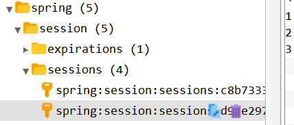

## 分布式会话

后端使用多台 tomcat，nginx 可能会分发一个用户到不同 tomcat，需要用户重新登陆


解决方案：

### session 复制

- 优点：无需修改代码，只需配置 tomcat
- 缺点：
  1. 多太 tomcat 之间同步传输占用带宽
  2. tomcat 性能指数下降
  3. session占用内存，无法有效水平扩展

> 参考：高并发（水平扩展，垂直扩展）https://blog.csdn.net/Dongguabai/article/details/83578092
>
> **垂直扩展**：提升单机处理能力
>
> **水平扩展**：只要增加服务器数量，就能线性扩充系统性能。水平扩展对系统架构设计是有要求的，如何在架构各层进行可水平扩展的设计，以及互联网公司架构各层常见的水平扩展实践，是本文重点讨论的内容。

### 前端存储

- 优点：不占用服务器内存
- 缺点：
  1. 存在安全风险
  2. 数据大小受 cookie 限制
  3. 占用外网带宽

### session 粘滞

ip hash

- 优点：无需修改代码，服务端可以水平扩展
- 缺点：
  1. 新增机器，会 rehash，导致重新登陆
  2. 引用重启，需要重新登陆

### 后端集中存储

- 优点：安全，容易水平扩展
- 缺点：
  1. 复杂
  2. 需要修改代码

## 使用 redis 存放 session 信息

5 种数据类型


**方法一：使用 Spring Session 实现 分布式Session**

```xml
<!--redis依赖。不同版本：
        1.x版本使用jedis客户端。
        2.x使用lettuce客户端，可能用到对象池，线程安全。-->
<dependency>
    <groupId>org.springframework.boot</groupId>
    <artifactId>spring-boot-starter-data-redis</artifactId>
</dependency>
<!--commons-pool2 对象池依赖-->
<dependency>
    <groupId>org.apache.commons</groupId>
    <artifactId>commons-pool2</artifactId>
</dependency>
<!--spring session 依赖-->
<dependency>
    <groupId>org.springframework.session</groupId>
    <artifactId>spring-session-data-redis</artifactId>
</dependency>
```

配置

```yaml
  # redis 配置
  redis:
    host: 127.0.0.1
    password: root
    # 默认是9637
    port: 9637
    # 数据库
    database: 6
    # 超时时间
    timeout: 10000ms
    lettuce:
      pool:
        # Maximum number of connections that can be allocated by the pool at a given time
        max-active: 8
        # Maximum amount of time a connection allocation should block before throwing an exception when the pool is
        # -1ms 无阻塞
        max-wait: 10000ms
        # 最大空闲连接
        max-idle: 200
        # 最小空闲连接
        min-idle: 8
```




**方法二：不在redis中存储session，而是存放 session中的用户信息**

只是用 spring data redis

```xml
<dependency>
    <groupId>org.springframework.boot</groupId>
    <artifactId>spring-boot-starter-data-redis</artifactId>
</dependency>
<dependency>
    <groupId>org.apache.commons</groupId>
    <artifactId>commons-pool2</artifactId>
</dependency>
```

配置：同方法一

配置 redisTemplate，设置序列化 

```java
@Configuration
public class RedisConfig {

    @Bean
    public RedisTemplate<String, Object> redisTemplate(RedisConnectionFactory connectionFactory) {

        RedisTemplate<String, Object> redisTemplate = new RedisTemplate<>();

        //序列化
        redisTemplate.setKeySerializer(new StringRedisSerializer());
        redisTemplate.setValueSerializer(new GenericJackson2JsonRedisSerializer());

        //hash类型序列化
        redisTemplate.setHashKeySerializer(new StringRedisSerializer());
        redisTemplate.setHashValueSerializer(new GenericJackson2JsonRedisSerializer());

        redisTemplate.setConnectionFactory(connectionFactory);//连接工厂

        return redisTemplate;
    }

}
```

redis 配置：连接本地连接失败，连接远程可以连接上 ==花了好长时间，最后发现端口号写成了 自己手机号后四位 9637== :walking_man: :sob:


## 优化登录功能

一般的业务接口，类似 `/goods/list`：

```java
@RequestMapping("/list")
public String list(@CookieValue(value = "user_ticket", required = false) String ticket,
                   Model model,
                   HttpSession session) {

    if (!StringUtils.hasLength(ticket)) return "login";

    //User user = (User) session.getAttribute(ticket);
    //从redis中拿
    User user = userService.getUserInfoByTicket(ticket);

    if (null == user) return "login";

    model.addAttribute("user", user);

    return "goodsList";
}
```

发现多余的部分：每个接口都要通过 user_ticket 从 redis 中取用户信息

```java
@RequestMapping("/list")
public String list(User user,       // 在 controller 入口之前做校验
                   Model model) {

    if (null == user) return "login";

    model.addAttribute("user", user);

    return "goodsList";
}
```


```java
@Component
@EnableWebMvc
public class WebConfig implements WebMvcConfigurer {

    @Autowired
    private UserArgumentResolver userArgumentResolver;

    @Override
    public void addArgumentResolvers(List<HandlerMethodArgumentResolver> resolvers) {
        resolvers.add(userArgumentResolver);//添加自定义参数解析器
    }
}
```


```java
@Component
public class UserArgumentResolver implements HandlerMethodArgumentResolver {

    @Autowired
    private IUserService userService;

	//判断是不是我们要处理的类型
    @Override
    public boolean supportsParameter(MethodParameter parameter) {
        return parameter.getParameterType() == User.class;
    }
	
    //入口参数处理
    @Override
    public Object resolveArgument(MethodParameter parameter, ModelAndViewContainer mavContainer, NativeWebRequest webRequest, WebDataBinderFactory binderFactory) throws Exception {

        HttpServletRequest request = webRequest.getNativeRequest(HttpServletRequest.class);

        String ticket = CookieUtil.getCookieValue(request, "user_ticket");
        if (StringUtils.hasLength(ticket)) {
            User user = userService.getUserInfoByTicket("user_ticket:" + ticket);
            return user;
        }
        return null;
    }
}
```


此时会出现 `no mapping for get 静态资源url`，修改配置以解决问题：

```yaml
spring:
  thymeleaf:
	prefix: classpath:/static/ # 将所有资源都放在该目录下
    suffix: .html
```


## 分布式会话登录功能总结

0、两次 md5 加密

1、一开始通过参数传递 mobile、password 需要对参数进行判断和校验

2、使用 @Valid 进行参**数校验**，以及自定义参数校验

3、校验失败时有异常，进行**全局异常处理**

4、**分布式 session** 问题，两种方式

5、每一个接口都需要做参数的校验，自定义 **用户参数** ，==在 controller 入口之前就做好了一层校验==


