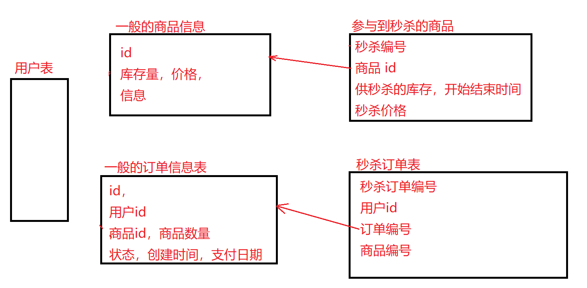

### 秒杀


#### 业务表及代码生成



**独立出秒杀表**：秒杀业务场景多，如果在一般的商品表和订单表上修改太麻烦。便于维护


SQL：四张表，没有 t_user 

```sql
SET NAMES utf8mb4;
SET FOREIGN_KEY_CHECKS = 0;

-- ----------------------------
-- Table structure for t_goods
-- ----------------------------
DROP TABLE IF EXISTS `t_goods`;
CREATE TABLE `t_goods` (
  `id` bigint NOT NULL AUTO_INCREMENT COMMENT '商品ID',
  `goods_name` varchar(16) DEFAULT NULL COMMENT '商品名称',
  `goods_title` varchar(64) DEFAULT NULL COMMENT '商品标题',
  `goods_img` varchar(64) DEFAULT NULL COMMENT '商品图片',
  `goods_detail` longtext COMMENT '商品详情',
  `goods_price` decimal(10,2) DEFAULT '0.00' COMMENT '商品价格',
  `goods_stock` int DEFAULT '0' COMMENT '商品库存，-1表示没有限制',
  PRIMARY KEY (`id`)
) ENGINE=InnoDB AUTO_INCREMENT=3 DEFAULT CHARSET=utf8mb4 COLLATE=utf8mb4_0900_ai_ci;

-- ----------------------------
-- Records of t_goods
-- ----------------------------
BEGIN;
INSERT INTO `t_goods` VALUES (1, 'IPHONE12', 'IPHONE12 64GB', '/img/iphone12.png', 'IPHONE12 64GB', 6299.00, 100);
INSERT INTO `t_goods` VALUES (2, 'IPHONE12 PRO', 'IPHONE12 PRO 128GB', '/img/iphone12pro.png', 'IPHONE12 PRO 128GB', 9299.00, 100);
COMMIT;


-- ----------------------------
-- Table structure for t_order
-- ----------------------------
DROP TABLE IF EXISTS `t_order`;
CREATE TABLE `t_order` (
  `id` bigint NOT NULL AUTO_INCREMENT COMMENT '订单ID',
  `user_id` bigint DEFAULT NULL COMMENT '用户ID',
  `goods_id` bigint DEFAULT NULL COMMENT '商品ID',
  `delivery_addr_id` bigint DEFAULT NULL COMMENT '收货地址ID',
  `goods_name` varchar(16) DEFAULT NULL COMMENT '冗余过来的商品名称',
  `goods_count` int DEFAULT '0' COMMENT '商品数量',
  `goods_price` decimal(10,2) DEFAULT '0.00' COMMENT '商品单价',
  `order_channel` tinyint DEFAULT '0' COMMENT '1pc,2android,3ios',
  `status` tinyint DEFAULT '0' COMMENT '订单状态：0新建未支付，1已支付，2已发货，3已收货，4已退款，5已完成',
  `create_date` datetime DEFAULT NULL COMMENT '订单的创建时间',
  `pay_date` datetime DEFAULT NULL COMMENT '支付时间',
  PRIMARY KEY (`id`)
) ENGINE=InnoDB AUTO_INCREMENT=294 DEFAULT CHARSET=utf8mb4 COLLATE=utf8mb4_0900_ai_ci;


-- ----------------------------
-- Table structure for t_seckill_goods
-- ----------------------------
DROP TABLE IF EXISTS `t_seckill_goods`;
CREATE TABLE `t_seckill_goods` (
  `id` bigint NOT NULL AUTO_INCREMENT COMMENT '秒杀商品ID',
  `goods_id` bigint NOT NULL COMMENT '秒杀商品ID',
  `seckill_price` decimal(10,2) DEFAULT '0.00' COMMENT '秒杀价',
  `stock_count` int DEFAULT NULL COMMENT '库存数量',
  `start_date` datetime DEFAULT NULL COMMENT '秒杀开始时间',
  `end_date` datetime DEFAULT NULL COMMENT '秒杀结束时间',
  PRIMARY KEY (`id`)
) ENGINE=InnoDB AUTO_INCREMENT=3 DEFAULT CHARSET=utf8mb4 COLLATE=utf8mb4_0900_ai_ci;

-- ----------------------------
-- Records of t_seckill_goods
-- ----------------------------
BEGIN;
INSERT INTO `t_seckill_goods` VALUES (1, 1, 629.00, 10, '2021-01-23 21:12:00', '2021-01-24 21:13:00');
INSERT INTO `t_seckill_goods` VALUES (2, 2, 929.00, 10, '2021-01-23 08:00:00', '2021-01-23 21:00:00');
COMMIT;


-- ----------------------------
-- Table structure for t_seckill_order
-- ----------------------------
DROP TABLE IF EXISTS `t_seckill_order`;
CREATE TABLE `t_seckill_order` (
  `id` bigint NOT NULL AUTO_INCREMENT COMMENT '秒杀订单ID',
  `user_id` bigint DEFAULT NULL COMMENT '用户ID',
  `order_id` bigint DEFAULT NULL COMMENT '订单ID',
  `goods_id` bigint DEFAULT NULL COMMENT '商品ID',
  PRIMARY KEY (`id`)
) ENGINE=InnoDB AUTO_INCREMENT=285 DEFAULT CHARSET=utf8mb4 COLLATE=utf8mb4_0900_ai_ci;


SET FOREIGN_KEY_CHECKS = 1;
```


#### 商品列表页

```html
<div class="container">
    <div class="panel panel-default">
        <div class="panel-heading">秒杀商品列表</div>
        <table class="table" id="goodslist">
            <tr>
                <td>商品名称</td>
                <td>商品图片</td>
                <td>商品原价</td>
                <td>秒杀价</td>
                <td>库存数量</td>
                <td>详情</td>
            </tr>
            <tr th:each="goods,goodsStat : ${goodsList}">
                <td th:text="${goods.goodsName}"></td>
                <td>
                </td>
                <td th:text="${goods.goodsPrice}"></td>
                <td th:text="${goods.seckillPrice}"></td>
                <td th:text="${goods.stockCount}"></td>
                <td><a th:href="'/goods/toDetail/'+${goods.id}">详情</a></td>
            </tr>
        </table>
    </div>

</div>
```

#### 商品详情页

```html
<div class="panel panel-default container">
    <div class="panel-heading">秒杀商品详情</div>
    <div class="panel-body">
        <span th:if="${user eq null}"> 您还没有登录，请登陆后再操作<br/></span>
        <span>没有收货地址的提示。。。</span></div>
    <table class="table" id="goods">
        <tr>
            <td>商品名称</td>
            <td colspan="3" th:text="${goods.goodsName}"></td>
        </tr>
        <tr>
            <td>商品图片</td>
            <td colspan="3"></td>
        </tr>
        <tr>
            <td>秒杀开始时间</td>
            <td th:text="${#dates.format(goods.startDate,'yyyy-MM-dd HH:mm:ss')}"></td>
            <td id="seckillTip">
                <input type="hidden" id="remainSeconds" th:value="${remainSeconds}">
                <input type="hidden" id="seckillStatus" th:value="${secKillStatus}">
                <span th:if="${secKillStatus eq 0}">
                    秒杀倒计时: <span id="countDown" th:text="${remainSeconds}"></span>秒
                </span>
                <span th:if="${secKillStatus eq 1}">秒杀进行中</span>
                <span th:if="${secKillStatus eq 2}">秒杀已结束</span>
            </td>
            <td>
                <form id="secKillForm" method="post" action="/seckill/doSeckill">
                    <input type="hidden" name="goodsId" th:value="${goodsId}">
                    <button class="btn btn-primary btn-block" type="submit" id="buyButton">立即秒杀</button>
                </form>
            </td>
        </tr>
        <tr>
            <td>商品原价</td>
            <td colspan="3" th:text="${goods.goodsPrice}"></td>
        </tr>
        <tr>
            <td>秒杀价</td>
            <td colspan="3" th:text="${goods.seckillPrice}"></td>
        </tr>
        <tr>
            <td>库存数量</td>
            <td colspan="3" th:text="${goods.stockCount}"></td>
        </tr>
    </table>
</div>
```

**秒杀倒计时逻辑：**

```js
$(function () {
    check()
});

function check() {
    $("#buyButton").attr("disabled", true)  // 禁用按钮

    var killStatus = $("#seckillStatus").val() //秒杀状态 0未开始，1进行中，2已结束

    //进行中，放开按钮
    if (killStatus === 1) {
        $("#buyButton").attr("disabled", false)
        return
    }

    //已结束
    if (killStatus === 2 ) return

    //未开始，倒计时
    sleepAndCountDown()
}

// 倒计时，直到到时，到时结束，否则再来一轮
function sleepAndCountDown() {
    var remainSeconds = $("#remainSeconds").val() // 剩余时间 >0倒计时，=0正在秒杀，<0已结束

    if (remainSeconds <= 0) {
        $("#buyButton").attr("disabled", false)
        $("#seckillTip").html("秒杀进行中")
        return
    }

    setTimeout(()=>{
        $("#remainSeconds").val(remainSeconds - 1)
        $("#countDown").text(remainSeconds - 1);
        sleepAndCountDown()
    }, 1000)
}
```

**后端返回商品详情：**

```java
@RequestMapping("/toDetail/{goodsId}")
public String detail(@PathVariable Long goodsId, User user, Model model) {
    if (null == user) return "login";

    GoodsVo goodsVo = goodsService.findGoodsVoByGoodsId(goodsId);
    model.addAttribute("user", user);
    model.addAttribute("goods", goodsVo);

    // 传给前端的秒杀数据
    Date startDate = goodsVo.getStartDate();
    Date endDate = goodsVo.getEndDate();
    Date nowDate = new Date();
    //秒杀状态 0未开始，1进行中，2已结束
    int secKillStatus = 0;
    //秒杀倒计时 >0倒计时，0进行中，-1已结束
    int remainSeconds = 0;
    //秒杀还未开始
    if (nowDate.before(startDate)) {
        remainSeconds = ((int) ((startDate.getTime() - nowDate.getTime()) / 1000));
    } else if (nowDate.after(endDate)) {
        //	秒杀已结束
        secKillStatus = 2;
        remainSeconds = -1;
    } else {
        //秒杀中
        secKillStatus = 1;
    }
    model.addAttribute("remainSeconds", remainSeconds);
    model.addAttribute("secKillStatus", secKillStatus);

    return "goodsDetail";
}
```


#### 秒杀业务编写

1. 库存判断，不得超卖
2. 一个用户只能购买一件，防止黄牛

```java
@RequestMapping("doSeckill")
public String kill(User user, Long goodsId, Model model) {

    if (user == null) return "login";
    if (goodsId == null) return "redirect:/goods/toList";

    GoodsVo goodsVo = goodsService.findGoodsVoByGoodsId(goodsId);

    // 判断秒杀库存，而不是商品库存
    if (goodsVo.getStockCount() < 1) {
        model.addAttribute("errmsg", RespTypeEnum.OUT_OF_STOCK.getMsg());
        return "secKillFail";
    }

    // 判断不得多买
    SeckillOrder seckillOrder = seckillOrderService.getOne(new QueryWrapper<SeckillOrder>()
            .eq("user_id", user.getId())
            .eq("goods_id", goodsId)); // 在秒杀记录中查看用户是否秒杀过该商品
    if (null != seckillOrder) {
        model.addAttribute("errmsg", RespTypeEnum.REPEATED_BUY_ERROR.getMsg());
        return "secKillFail";
    }

    Order order = orderService.seckill(user, goodsVo);

    model.addAttribute("order", order);
    model.addAttribute("goods", goodsVo);

    return "orderDetail";
}
```

具体的**秒杀业务**：

```java
@Override
public Order seckill(User user, GoodsVo goodsVo) {

    //1减库存
    SeckillGoods goods = seckillGoodsService.getOne(new QueryWrapper<SeckillGoods>()
            .eq("goods_id", goodsVo.getId()));//获取目标商品
    goodsVo.setStockCount(goods.getStockCount() - 1);
    seckillGoodsService.updateById(goods);

    //2生成订单
    Order order = new Order();
    //order.setId();  auto int
    order.setUserId(user.getId());
    order.setGoodsId(goodsVo.getId());
    order.setDeliveryAddrId(10001L);//邮寄地址编号
    order.setGoodsName(goodsVo.getGoodsName());
    order.setGoodsCount(1);
    order.setGoodsPrice(goodsVo.getSeckillPrice());
    order.setOrderChannel(2);//下单渠道
    order.setStatus(0);//新建未支付
    order.setCreateDate(new Date());
    orderMapper.insert(order);
    //生成秒杀订单
    SeckillOrder seckillOrder = new SeckillOrder();
    seckillOrder.setUserId(user.getId());
    seckillOrder.setOrderId(order.getId());//generatedkey
    seckillOrder.setGoodsId(goods.getGoodsId());
    seckillOrderService.save(seckillOrder);

    return order;
}
```


大致逻辑：

前端点击跳转商品详情页，后端渲染页面呈现秒杀状态。

在指定的（前端指定的）时间内可以进行秒杀，这个数据最终来自数据库

