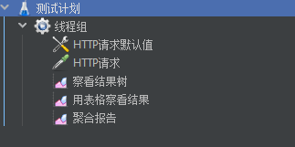
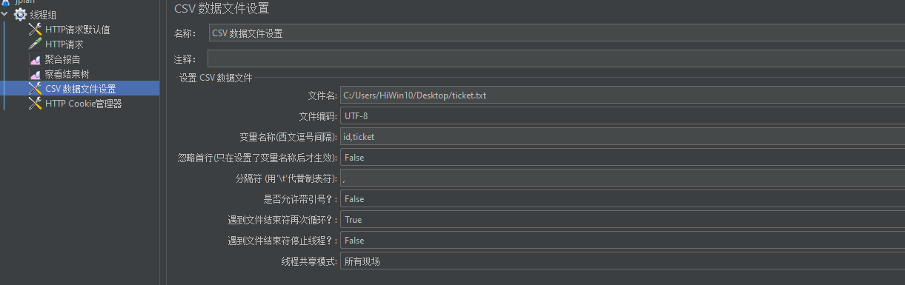
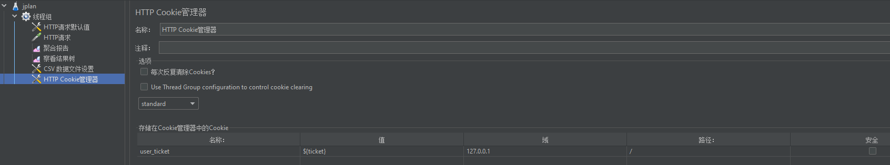

### jmeter 压测


jmeter配置 - **jmeter.properties**

```properties
language=zh_CN
sampleresult.default.encoding=UTF-8
```


> 名词学习 https://www.cnblogs.com/leadership/p/11555409.html
>
> **QPS**：意思是“每秒查询率”，是一台服务器每秒能够响应的查询次数，是对一个特定的查询服务器在规定时间内所处理流量多少的衡量标准。
>
> 
>
> **TPS**：每秒处理的事务数目。一个事务是指一个客户机向服务器发送请求然后服务器做出反应的过程。
>
> 客户机在发送请求时开始计时，收到服务器响应后结束计时，以此来计算使用的时间和完成的事务个数，最终利用这些信息作出的评估分。
>
> TPS 的过程包括：客户端请求服务端、服务端内部处理、服务端返回客户端。
>
> Qps 基本类似于 Tps，但是不同的是，对于一个页面的一次访问，形成一个 Tps；但一次页面请求，可能产生多次对服务器的请求，服务器对这些请求，就可计入“Qps”之中。


环境准备：mysql、java、redis（使用 docker 容器进行安装）


**jemter简单测试**

线程组、http请求默认值（配置元件中）、http请求




**在 Unix 上测试**

出现问题：成功登录，但是页面跳转失败，进一步发现 cookie 没设置上，最后发现是 CookieUtil 的 bug（根据 request 对象获取域名逻辑错误）

unix上进行 jmeter 压测

**root@jay bin#   jmeter.sh   -n   -t   jplan.jmx     -l    result.jtl**

- jplan.jmx  文件是 windows 上jmeter的jui测试保存结果
- result.jtl  是生成的报告，在 聚合报告 中查看


#### 压力测试


准备：由简单到复杂

- 单用户压力测试。不带参数接口测试（比如 /goods/toList），带参数接口测试（比如 /login）
- 多用户压力测试。多个用户访问同一个接口（比如带参接口 /goods/toList，此时需要 **身份信息**，即 cookie ）


自定义cookie：

```
13312345678,;ljksiogajsldgnalsdgioasag12
```






