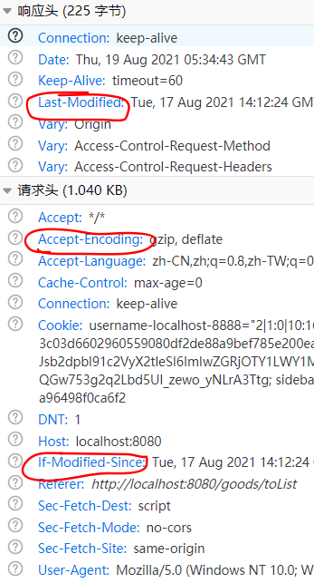

### 页面优化


**页面缓存**

**将 “具有静态属性” 页面放在 redis 缓存中**

比如 商品列表页、商品详情页

重点：设置一定的过期时间

应用场景：不怎么变更的页面（**分页**的情况，只进行 前边几页的分页）


登陆页面：

```java
@GetMapping(value = "", produces = "text/html;charset=utf-8")
@ResponseBody
public String login(@CookieValue(value = "user_ticket", required = false) String ticket,
                    HttpServletRequest request,
                    HttpServletResponse response) {

    if (StringUtils.hasLength(ticket)) {//有ticket则重定向到 “首页”
        return "<script>location.href='/goods/toList'</script>";
    }

    ValueOperations opsFV = redisTemplate.opsForValue();
    Object html = opsFV.get("html:login");
    if (null == html) {
        WebContext context = new WebContext(request, response, request.getServletContext(), request.getLocale());
        html = thymeleafViewResolver.getTemplateEngine().process("login", context);
        opsFV.set("html:login", html, 10, TimeUnit.SECONDS);//设置过期时间
    }

    return (String) html;
}
```

商品列表页面：

```java
@RequestMapping(value = "/toList", produces = "text/html;charset=utf-8")
@ResponseBody
public String list(User user,       // 在 controller 入口之前做校验
                   Model model,
                   HttpServletRequest request,
                   HttpServletResponse response) throws IOException {

    if (null == user) {
        CookieUtil.deleteCookie(request, response, "user_ticket");//过期cookie导致，清除cookie
        return "<script>location.href='/login'</script>";//重定向
    }

    ValueOperations opsFV = redisTemplate.opsForValue();
    Object html = opsFV.get("html:goods:toList");

    if (null != html) return (String) html;

    model.addAttribute("user", user);//用户信息
    List<GoodsVo> goodsVoList = goodsService.findAllGoodsVo();
    model.addAttribute("goodsList", goodsVoList);//商品列表

    WebContext context = new WebContext(request, response, request.getServletContext(), request.getLocale(), model.asMap());
    html = thymeleafViewResolver.getTemplateEngine().process("goodsList", context);
    opsFV.set("html:goods:toList", html, 10, TimeUnit.SECONDS);

    return (String) html;
}
```

商品详情页：

```java
@RequestMapping("/toDetail/{goodsId}")
@ResponseBody
public String detail(@PathVariable Long goodsId, User user, Model model,
                     HttpServletRequest request,
                     HttpServletResponse response) {

    if (null == user) {
        CookieUtil.deleteCookie(request, response, "user_ticket");//过期cookie导致，清除cookie
        return "<script>location.href='/login'</script>";
    }

    GoodsVo goodsVo = goodsService.findGoodsVoByGoodsId(goodsId);
    model.addAttribute("user", user);
    model.addAttribute("goods", goodsVo);
    //.....

    ValueOperations opsFV = redisTemplate.opsForValue();
    Object html = opsFV.get("html:goods:toDetail" + goodsId);

    if (null != html) return (String) html;

    WebContext context = new WebContext(request, response, request.getServletContext(), request.getLocale(), model.asMap());
    html = thymeleafViewResolver.getTemplateEngine().process("goodsDetail", context);
    opsFV.set("html:goods:toDetail" + goodsId, html, 10, TimeUnit.SECONDS);

    return (String) html;
}
```

> 这里有问题 :heavy_exclamation_mark: :x: 有问题提交：https://github.com/engureguo/seckill/commit/a1c1438e097130bb7e4412f14ab3d143672921ff
>
> 商品详情页：有秒杀计时，需要适时获取数据，而 redis 中的缓存的页面是“过时的”（我们设置了 expire ）


**对象缓存**

**将重要的信息 vo 存放在 redis 中**

比如用户信息：登录时将用户信息进行缓存，doLogin() 中

```java
redisTemplate.opsForValue().set("user_ticket:" + ticket, user, 1, TimeUnit.HOURS);
```

用户访问接口时，先从 redis 中取他的信息：

```java
@Override
public Object resolveArgument(MethodParameter parameter, ModelAndViewContainer mavContainer, NativeWebRequest webRequest, WebDataBinderFactory binderFactory) throws Exception {

    HttpServletRequest request = webRequest.getNativeRequest(HttpServletRequest.class);

    String ticket = CookieUtil.getCookieValue(request, "user_ticket");

    if (StringUtils.hasLength(ticket)) {
        return userService.getUserInfoByTicket(ticket);
    }
    return null;
}


@Override
public User getUserInfoByTicket(String ticket) {

    if (!StringUtils.hasLength(ticket))
        return null;

    return (User) redisTemplate.opsForValue().get("user_ticket:" + ticket);//从redis中拿
}
```


### 商品详情页

该页面有秒杀的部分，需要**实时**获取页面中涉及的最新**数据**。

**将 thymeleaf 换成 静态页面，通过 ajax 获取数据**

```js
function getDetails() {
    var goodsId = g_getQueryString("goodsId");
    $.ajax({
        url: '/goods/detail/' + goodsId,
        type: 'GET',
        success: function (data) {
            if (data.code === 200) {
                render(data.data);
            } else {
                layer.msg(data.msg);
            }
        },
        error: function () {
            layer.msg("客户端请求出错");
        }
    });

}

function render(detail) {
    var user = detail.user;
    var goods = detail.goodsVo;
    var remainSeconds = detail.remainSeconds;
    var seckillStatus = detail.secKillStatus;
    if (user) {
        $("#userTip").hide();
    }
    $("#goodsName").text(goods.goodsName);
    $("#goodsImg").attr("src", goods.goodsImg);
    $("#startTime").text(new Date(goods.startDate).format("yyyy-MM-dd HH:mm:ss"));
    $("#remainSeconds").text(remainSeconds);
    $("#seckillStatus").text(seckillStatus)
    $("#goodsId").val(goods.id);
    $("#goodsPrice").text(goods.goodsPrice);
    $("#seckillPrice").text(goods.seckillPrice);
    $("#stockCount").text(goods.stockCount);

    check();
}
```


### 秒杀功能

**秒杀实现**

```java
function doSeckill() {

    var goodsId = g_getQueryString("goodsId");
    $.ajax({
        url: '/seckill/doSeckill2/',
        data: {
            "goodsId": goodsId
        },
        type: 'POST',
        success: function (data) {
            if (data.code == 200) {
                location.href = "/orderDetail.htm?orderId=" + data.data.id //跳转到订单详情页
            } else {
                layer.msg(data.msg)
            }
        },
        error: function () {
            layer.msg("秒杀失败~")
        }
    })

}
```

**业务代码：**

```java
@RequestMapping(value = "doSeckill2", method = RequestMethod.POST)
@ResponseBody
public RespBean kill2(User user, @RequestParam("goodsId") Long goodsId) {

    if (user == null)
        return RespBean.error(RespTypeEnum.SESSION_NOT_EXIST);

    GoodsVo goodsVo = goodsService.findGoodsVoByGoodsId(goodsId);

    // 判断秒杀库存，而不是商品库存
    if (goodsVo.getStockCount() < 1) {
        return RespBean.error(RespTypeEnum.OUT_OF_STOCK);
    }

    // 判断不得多买
    SeckillOrder seckillOrder = seckillOrderService.getOne(new QueryWrapper<SeckillOrder>()
            .eq("user_id", user.getId())
            .eq("goods_id", goodsId)); // 在秒杀记录中查看用户是否秒杀过该商品
    if (null != seckillOrder) {
        return RespBean.error(RespTypeEnum.REPEATED_BUY_ERROR);
    }

    Order order = orderService.seckill(user, goodsVo);

    return RespBean.success(order);//秒杀成功，返回订单信息
}
```


#### 订单详情页面

同样使用静态页面 ajax 请求数据的思路

**订单信息请求接口**

```js
function getOrderDetail() {
    var orderId = g_getQueryString("orderId");
    $.ajax({
        url: '/killOrder/detail',
        type: 'POST',
        data: {
            orderId: orderId
        },
        success: function (data) {
            if (data.code == 200) {
                render(data.data);
            } else {
                layer.msg(data.msg);
            }
        },
        error: function () {
            layer.msg("客户端请求出错");
        }
    });
}
```

**订单信息业务实现**

```java
/**
 * 根据普通订单的orderId找到普通订单
 */
@PostMapping("/detail")
@ResponseBody
public RespBean detail(Long orderId, User user) {

    if (user == null) return RespBean.error(RespTypeEnum.SESSION_NOT_EXIST);

    //查出 商品和订单，返回数据
    Order order = orderService.getOne(new QueryWrapper<Order>()
            .eq("id", orderId)
            .eq("user_id", user.getId()));

    if (null == order)
        return RespBean.error(RespTypeEnum.ORDER_NOT_EXIST);

    GoodsVo goodsVo = goodsService.findGoodsVoByGoodsId(order.getGoodsId());

    OrderDetailVo orderDetailVo = new OrderDetailVo();
    orderDetailVo.setOrder(order);
    orderDetailVo.setGoodsVo(goodsVo);

    return RespBean.success(orderDetailVo);
}
```

**配置缓存 :triangular_flag_on_post: **

```yaml
spring:
  # 静态资源处理
  resources:
    # 是否开启资源处理，默认true
    add-mappings: true
    cache:
      cachecontrol:
        # 响应缓存的最大时间，单位秒
        max-age: 3600
    chain:
      # 启用资源链
      enabled: true
      # 资源链启动缓存，默认启动
      cache: true
      # 是否启用已压缩资源(gzip, brotli)的解析，默认禁用
      compressed: true
      # Whether to enable HTML5 application cache manifest rewriting
      # 是否启用HTML 5应用程序缓存清单重写
      html-application-cache: true
    # Locations of static resources. Defaults to classpath:[/META-INF/resources/, /resources/, /static/, /public/].
    static-locations: classpath:/static/
```

压缩功能：可以将响应进行压缩，大幅减少带宽

浏览器缓存：`Last-Modified`和`If-Modiified-Since`

| 参数名                | 解释                                                         |
| --------------------- | ------------------------------------------------------------ |
| `Last-Modified`       | The **`Last-Modified`**  是一个响应首部，其中包含源头服务器认定的资源做出修改的日期及时间。 它通常被用作一个验证器来判断接收到的或者存储的资源是否彼此一致。由于精确度比  [`ETag`](https://developer.mozilla.org/zh-CN/docs/Web/HTTP/Headers/ETag) 要低，所以这是一个备用机制。包含有  [`If-Modified-Since`](https://developer.mozilla.org/zh-CN/docs/Web/HTTP/Headers/If-Modified-Since) 或 [`If-Unmodified-Since`](https://developer.mozilla.org/zh-CN/docs/Web/HTTP/Headers/If-Unmodified-Since) 首部的条件请求会使用这个字段。[解释](https://developer.mozilla.org/zh-CN/docs/Web/HTTP/Headers/Last-Modified) |
| `If-Modified-Since`   | **`If-Modified-Since`** 是一个条件式请求首部，服务器只在所请求的资源在给定的日期时间之后对内容进行过修改的情况下才会将资源返回，状态码为 [`200`](https://developer.mozilla.org/zh-CN/docs/Web/HTTP/Status/200)  。如果请求的资源从那时起未经修改，那么返回一个不带有消息主体的 [`304`](https://developer.mozilla.org/zh-CN/docs/Web/HTTP/Status/304)  响应，而在 [`Last-Modified`](https://developer.mozilla.org/zh-CN/docs/Web/HTTP/Headers/Last-Modified) 首部中会带有上次修改时间。 不同于  [`If-Unmodified-Since`](https://developer.mozilla.org/zh-CN/docs/Web/HTTP/Headers/If-Unmodified-Since), `If-Modified-Since` 只可以用在 [`GET`](https://developer.mozilla.org/zh-CN/docs/Web/HTTP/Methods/GET) 或 [`HEAD`](https://developer.mozilla.org/zh-CN/docs/Web/HTTP/Methods/HEAD) 请求中。 |
| `If-Unmodified-Since` | HTTP协议中的 **`If-Unmodified-Since`** 消息头用于请求之中，使得当前请求成为条件式请求：只有当资源在指定的时间之后没有进行过修改的情况下，服务器才会返回请求的资源，或是接受 [`POST`](https://developer.mozilla.org/zh-CN/docs/Web/HTTP/Methods/POST) 或其他 non-[safe](https://developer.mozilla.org/zh-CN/docs/Glossary/safe) 方法的请求。如果所请求的资源在指定的时间之后发生了修改，那么会返回 [`412`](https://developer.mozilla.org/zh-CN/docs/Web/HTTP/Status/412) (Precondition Failed) 错误。<br />常见的应用场景有两种：<br /> 1. 与 non-[safe](https://developer.mozilla.org/zh-CN/docs/Glossary/safe) 方法如 [`POST`](https://developer.mozilla.org/zh-CN/docs/Web/HTTP/Methods/POST) 搭配使用，可以用来[优化并发控制](https://en.wikipedia.org/wiki/Optimistic_concurrency_control)，例如在某些wiki应用中的做法：假如在原始副本获取之后，服务器上所存储的文档已经被修改，那么对其作出的编辑会被拒绝提交。<br /> 2. 与含有 [`If-Range`](https://developer.mozilla.org/zh-CN/docs/Web/HTTP/Headers/If-Range) 消息头的范围请求搭配使用，用来确保新的请求片段来自于未经修改的文档。 |

f12查看 **请求头**：



> :triangular_flag_on_post: 面试官：说说 HTTP 常见的请求头有哪些? 作用？
>
> https://blog.csdn.net/weixin_44475093/article/details/117309957


