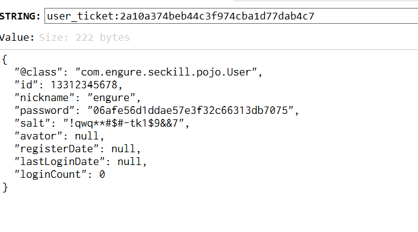

### 页面优化


**页面缓存**

**将 “具有静态属性” 页面放在 redis 缓存中**

比如 商品列表页、商品详情页

重点：设置一定的过期时间

应用场景：不怎么变更的页面（**分页**的情况，只进行 前边几页的分页）


登陆页面：

```java
@GetMapping(value = "", produces = "text/html;charset=utf-8")
@ResponseBody
public String login(@CookieValue(value = "user_ticket", required = false) String ticket,
                    HttpServletRequest request,
                    HttpServletResponse response) {

    if (StringUtils.hasLength(ticket)) {//有ticket则重定向到 “首页”
        return "<script>location.href='/goods/toList'</script>";
    }

    ValueOperations opsFV = redisTemplate.opsForValue();
    Object html = opsFV.get("html:login");
    if (null == html) {
        WebContext context = new WebContext(request, response, request.getServletContext(), request.getLocale());
        html = thymeleafViewResolver.getTemplateEngine().process("login", context);
        opsFV.set("html:login", html, 10, TimeUnit.SECONDS);//设置过期时间
    }

    return (String) html;
}
```

商品列表页面：

```java
@RequestMapping(value = "/toList", produces = "text/html;charset=utf-8")
@ResponseBody
public String list(User user,       // 在 controller 入口之前做校验
                   Model model,
                   HttpServletRequest request,
                   HttpServletResponse response) throws IOException {

    if (null == user) {
        CookieUtil.deleteCookie(request, response, "user_ticket");//过期cookie导致，清除cookie
        return "<script>location.href='/login'</script>";//重定向
    }

    ValueOperations opsFV = redisTemplate.opsForValue();
    Object html = opsFV.get("html:goods:toList");

    if (null != html) return (String) html;

    model.addAttribute("user", user);//用户信息
    List<GoodsVo> goodsVoList = goodsService.findAllGoodsVo();
    model.addAttribute("goodsList", goodsVoList);//商品列表

    WebContext context = new WebContext(request, response, request.getServletContext(), request.getLocale(), model.asMap());
    html = thymeleafViewResolver.getTemplateEngine().process("goodsList", context);
    opsFV.set("html:goods:toList", html, 10, TimeUnit.SECONDS);

    return (String) html;
}
```

商品详情页：

```java
@RequestMapping("/toDetail/{goodsId}")
@ResponseBody
public String detail(@PathVariable Long goodsId, User user, Model model,
                     HttpServletRequest request,
                     HttpServletResponse response) {

    if (null == user) {
        CookieUtil.deleteCookie(request, response, "user_ticket");//过期cookie导致，清除cookie
        return "<script>location.href='/login'</script>";
    }

    GoodsVo goodsVo = goodsService.findGoodsVoByGoodsId(goodsId);
    model.addAttribute("user", user);
    model.addAttribute("goods", goodsVo);
    //.....

    ValueOperations opsFV = redisTemplate.opsForValue();
    Object html = opsFV.get("html:goods:toDetail" + goodsId);

    if (null != html) return (String) html;

    WebContext context = new WebContext(request, response, request.getServletContext(), request.getLocale(), model.asMap());
    html = thymeleafViewResolver.getTemplateEngine().process("goodsDetail", context);
    opsFV.set("html:goods:toDetail" + goodsId, html, 10, TimeUnit.SECONDS);

    return (String) html;
}
```

> 这里有问题 :heavy_exclamation_mark: :x: 有问题提交：https://github.com/engureguo/seckill/commit/a1c1438e097130bb7e4412f14ab3d143672921ff
>
> 商品详情页：有秒杀计时，需要适时获取数据，而 redis 中的缓存的页面是“过时的”（我们设置了 expire ）


**对象缓存**

**将重要的信息 vo 存放在 redis 中**

比如用户信息：登录时将用户信息进行缓存，doLogin() 中

```java
redisTemplate.opsForValue().set("user_ticket:" + ticket, user, 1, TimeUnit.HOURS);
```

用户访问接口时，先从 redis 中取他的信息：

```java
@Override
public Object resolveArgument(MethodParameter parameter, ModelAndViewContainer mavContainer, NativeWebRequest webRequest, WebDataBinderFactory binderFactory) throws Exception {

    HttpServletRequest request = webRequest.getNativeRequest(HttpServletRequest.class);

    String ticket = CookieUtil.getCookieValue(request, "user_ticket");

    if (StringUtils.hasLength(ticket)) {
        return userService.getUserInfoByTicket(ticket);
    }
    return null;
}


@Override
public User getUserInfoByTicket(String ticket) {

    if (!StringUtils.hasLength(ticket))
        return null;

    return (User) redisTemplate.opsForValue().get("user_ticket:" + ticket);//从redis中拿
}
```



### 商品详情页

该页面有秒杀的部分，需要实时获取页面中设计的最新数据。

**将 thymeleaf 换成 静态页面，通过 ajax 获取数据**

```js
function getDetails() {
    var goodsId = g_getQueryString("goodsId");
    $.ajax({
        url: '/goods/detail/' + goodsId,
        type: 'GET',
        success: function (data) {
            if (data.code === 200) {
                render(data.data);
            } else {
                layer.msg(data.msg);
            }
        },
        error: function () {
            layer.msg("客户端请求出错");
        }
    });

}

function render(detail) {
    var user = detail.user;
    var goods = detail.goodsVo;
    var remainSeconds = detail.remainSeconds;
    var seckillStatus = detail.secKillStatus;
    if (user) {
        $("#userTip").hide();
    }
    $("#goodsName").text(goods.goodsName);
    $("#goodsImg").attr("src", goods.goodsImg);
    $("#startTime").text(new Date(goods.startDate).format("yyyy-MM-dd HH:mm:ss"));
    $("#remainSeconds").text(remainSeconds);
    $("#seckillStatus").text(seckillStatus)
    $("#goodsId").val(goods.id);
    $("#goodsPrice").text(goods.goodsPrice);
    $("#seckillPrice").text(goods.seckillPrice);
    $("#stockCount").text(goods.stockCount);

    check();
}
```


