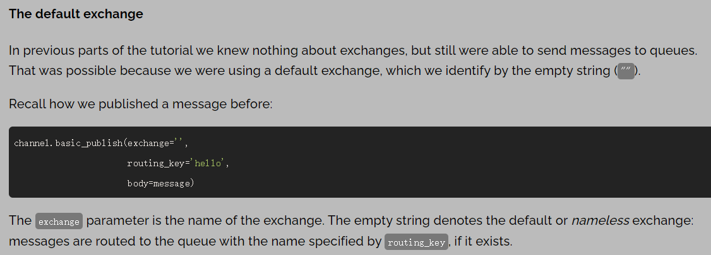
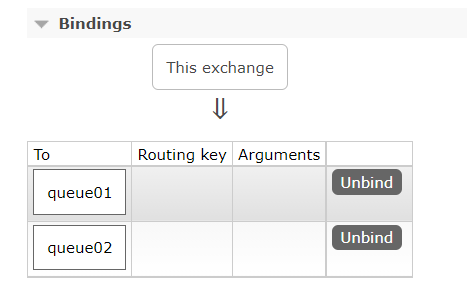
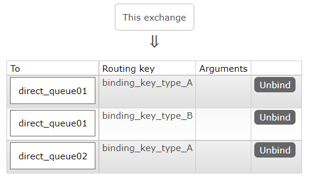

## 服务优化


### RabbitMQ

**安装**

https://blog.csdn.net/u014045708/article/details/119078977

**RabbitMQ 管控台**


**RabbitMQ 与 SpringBoot 集成**

依赖

```xml
<!--rabbitmq依赖-->
<dependency>
    <groupId>org.springframework.boot</groupId>
    <artifactId>spring-boot-starter-amqp</artifactId>
</dependency>
```

配置

```yaml
spring:
  # rabbitmq
  rabbitmq:
    # 服务器
    host: 192.168.217.132
    # 端口
    port: 5672
    # 默认 guest
    username: guest
    # 密码 默认 guest
    password: guest
    # 虚拟主机
    virtual-host: /
    listener:
      simple:
        # Minimum number of listener invoker threads
        # 监听器调用线程的最小数量
        # 消费者最小数量
        concurrency: 10
        # Maximum number of listener invoker threads.
        # 消费者最大数量
        max-concurrency: 10
        # Maximum number of unacknowledged messages that can be outstanding at each consumer.
        # 限制消费者每次只处理一条消息，处理完再继续下一条消息
        prefetch: 1
        # Whether to start the container automatically on startup.
        # 启动时是否启动容器
        auto-startup: true
        # Whether rejected deliveries are re-queued by default.
        # 被拒绝时是否重新入队
        default-requeue-rejected: true
    template:
      retry:
        # Whether publishing retries are enabled.
        # 发布重试，默认 false
        enabled: true
        # 重试时间，默认 1000ms
        initial-interval: 1000ms
        # Maximum number of attempts to deliver a message.
        # 重试最大次数，默认 3 次
        max-attempts: 3
        # Maximum duration between attempts.
        # 重试最大间隔时间，默认 10000ms
        max-interval: 10000ms
        # Multiplier to apply to the previous retry interval.
        # 重试间隔倍数。如果配置为 2，第一次间隔 10s，第二次间隔 20s，第三次间隔 40s，，，
        multiplier: 1
```

rabbitMQ配置类

```java
@Configuration
public class RabbitMQConfig {

    @Bean
    public Queue queue() {
        // durable=true 持久化，当 队列和消息 同时配置持久化时，可以持久化
        return new Queue("queue", true);
    }

}
```

发送消息对象

```java
@Service
@Slf4j
public class MQSender {

    @Autowired
    private RabbitTemplate rabbitTemplate;

    public void send(Object msg) {
        log.info("发送消息：" + msg);
        rabbitTemplate.convertAndSend("queue", msg);
    }

}
```

接收消息对象

```java
@Service
@Slf4j
public class MQReceiver {

    @RabbitListener(queues = "queue")
    public void receive(Object msg) {
        log.info("接收消息：" + msg);
    }

}
```

controller 接口

```java
@Autowired
private MQSender mqSender;

/**
 * 测试发送 rabbitmq 消息
 *
 * @return
 */
@GetMapping("/mq")
@ResponseBody
public RespBean mq() {
    mqSender.send("hello RabbitMQ ~");
    return RespBean.success();
}
```

日志

```
xxxxx: 发送消息：hello RabbitMQ ~
xxxxx: 接收消息：(Body:'hello RabbitMQ ~' MessageProperties [headers={}, contentType=text/plain, contentEncoding=UTF-8, contentLength=0, receivedDeliveryMode=PERSISTENT, priority=0, redelivered=false, receivedExchange=, receivedRoutingKey=queue, deliveryTag=1, consumerTag=amq.ctag-_tnPWyh3mtqFgz6YPpliNQ, consumerQueue=queue])
```


### fanout exchange

类似广播模型


上边的例子中，我们直接将消息发送给了某个 `routingkey`，它的名字和 定义的队列 同名：

```java
rabbitTemplate.convertAndSend("queue", msg);
```

消费者则是从指定的队列取消息：

```java
@RabbitListener(queues = "queue")
public void receive(Object msg) {
    log.info("接收消息：" + msg);
}
```


> 参考：
>
> RabbitMQ 消息传递模型的核心思想是**生产者从不直接向队列发送任何消息**。 实际上，生产者经常甚至根本不知道消息是否会被传送到任何队列。
>
> 相反，**生产者只能将消息发送到 *exchange***。 交换是一件非常简单的事情。 一方面它接收来自生产者的消息，另一方面将它们推送到队列中。 交换所必须确切地知道如何处理它收到的消息。 它应该附加到特定队列吗？ 它应该附加到许多队列中吗？ 或者它应该被丢弃。 其**规则由*交换类型*定义**。
>
> 

每个虚拟主机 vhost 默认的交换机：

> **The default exchange** is implicitly bound to every queue, with a routing key equal to the queue name.
>
> It is not possible to explicitly bind to, or unbind from the default exchange. It also cannot be deleted.
>
> 默认交换机隐式绑定到每个队列，路由键等于队列名称。
>
> 无法明确绑定到默认交换或从默认交换中解除绑定。 它也无法删除。

之前简单的消费者生产者例子中，生产者通过 路由键 将消息发送给默认交换机，默认交换机隐式与每个队列绑定，所以交换机通过 routingKey 将消息发送给指定的队列




**fanout 模式**：可以将队列**绑定**到特定的交换机上，背后的机制是 交换机 作为生产者和队列关系纽带

> A binding is a relationship between an exchange and a queue. This can be simply read as: the queue is interested in messages from this exchange.


小案例：

创建交换机和队列，配置绑定关系

```java
public static final String QUEUE01 = "queue01";
public static final String QUEUE02 = "queue02";
public static final String FANOUT_EXCHANGE = "fanout_exchange";

@Bean
public Queue queue01() {
    return new Queue(QUEUE01, true);
}

@Bean
public Queue queue02() {
    return new Queue(QUEUE02, true);
}

@Bean
public FanoutExchange fanoutExchange() {
    return new FanoutExchange(FANOUT_EXCHANGE);
}

@Bean
public Binding binding01() {
    return BindingBuilder.bind(queue01()).to(fanoutExchange());
}

@Bean
public Binding binding02() {
    return BindingBuilder.bind(queue02()).to(fanoutExchange());
}
```

生产者

```java
/**
 * 验证 fanout 模式，给交换机发送消息
 *
 * @param msg
 */
public void sendByFanout(Object msg) {
    log.info("发送消息" + msg);
    rabbitTemplate.convertAndSend(RabbitMQConfig.FANOUT_EXCHANGE, "", msg);
}
```

消费者

```java
@RabbitListener(queues = RabbitMQConfig.QUEUE01)
public void receive01(Object msg) {
    log.info("接收消息：" + msg);
}

@RabbitListener(queues = RabbitMQConfig.QUEUE02)
public void receive02(Object msg) {
    log.info("接收消息：" + msg);
}
```

日志

```
xxxx: 发送消息hello Fanout, are you broadcast?

xxxx: 接收消息：(Body:'hello Fanout, are you broadcast?' MessageProperties [headers={}, contentType=text/plain, contentEncoding=UTF-8, contentLength=0, receivedDeliveryMode=PERSISTENT, priority=0, redelivered=false, receivedExchange=fanout_exchange, receivedRoutingKey=, deliveryTag=1, consumerTag=amq.ctag-B2d0tv6n6fnqFzWHMhQZFg, consumerQueue=queue01])

xxxx: 接收消息：(Body:'hello Fanout, are you broadcast?' MessageProperties [headers={}, contentType=text/plain, contentEncoding=UTF-8, contentLength=0, receivedDeliveryMode=PERSISTENT, priority=0, redelivered=false, receivedExchange=fanout_exchange, receivedRoutingKey=, deliveryTag=1, consumerTag=amq.ctag-zE_pxr7IP_rx3dsxhPo78A, consumerQueue=queue02])
```

控制台





### direct exchange

在 fanout 的基础上升级，队列和交换机已经建立联系，通过 **在交换机和队列绑定时添加路由键** 过滤消息

比较：

- fanout exchange：无差别广播给已经绑定的队列所有消息
- direct exchange：广播给已经绑定的队列指定的消息（通过 bingdingKey）

> We were using **a fanout exchange**, which doesn't give us too much flexibility - it's only capable of **mindless broadcasting**.
>
> We will use a direct exchange instead. The routing algorithm behind **a direct exchange** is simple - **a message goes to the queues whose binding key exactly matches the routing key of the message**.
>
> 


小案例：

```java
public static final String DIRECT_QUEUE01 = "direct_queue01";
public static final String DIRECT_QUEUE02 = "direct_queue02";
public static final String DIRECT_EXCHANGE = "direct_exchange";
public static final String BINDING_KEY_TYPE_A = "binding_key_type_A";
public static final String BINDING_KEY_TYPE_B = "binding_key_type_B";

@Bean
public Queue direct_queue01() {
    return new Queue(DIRECT_QUEUE01, true);
}

@Bean
public Queue direct_queue02() {
    return new Queue(DIRECT_QUEUE02, true);
}

@Bean
public DirectExchange directExchange() {
    return new DirectExchange(DIRECT_EXCHANGE);
}

/*
                      direct exchange
queue01 <---  A,B  ----------|
queue02 <---   A   ----------

queue01 接收 A和B 消息
queue02 接收 A 消息

 */

@Bean
public Binding binding_queue01_01() {
    //绑定同时关联 bindingKey
    return BindingBuilder.bind(direct_queue01()).to(directExchange()).with(BINDING_KEY_TYPE_A);
}

@Bean
public Binding binding_queue01_02() {
    return BindingBuilder.bind(direct_queue01()).to(directExchange()).with(BINDING_KEY_TYPE_B);
}

@Bean
public Binding binding_queue02() {
    //可以多重绑定
    return BindingBuilder.bind(direct_queue02()).to(directExchange()).with(BINDING_KEY_TYPE_A);
}
```

生产者

```java
public void sendByDirect_a(Object msg) {
    log.info("direct 发送" + RabbitMQConfigDirect.BINDING_KEY_TYPE_A + "消息：" + msg);
    // (direct交换机，bindingKey，obj_msg)
    rabbitTemplate.convertAndSend(RabbitMQConfigDirect.DIRECT_EXCHANGE,
            RabbitMQConfigDirect.BINDING_KEY_TYPE_A, msg);
}

public void sendByDirect_b(Object msg) {
    log.info("direct 发送" + RabbitMQConfigDirect.BINDING_KEY_TYPE_B + "消息：" + msg);
    // (direct交换机，bindingKey，obj_msg)
    rabbitTemplate.convertAndSend(RabbitMQConfigDirect.DIRECT_EXCHANGE,
            RabbitMQConfigDirect.BINDING_KEY_TYPE_B, msg);
}
```

消费者

```java
@RabbitListener(queues = RabbitMQConfigDirect.DIRECT_QUEUE01)
public void receive_direct_queue01(Object msg) {
    log.info("收到消息：" + msg);
}

@RabbitListener(queues = RabbitMQConfigDirect.DIRECT_QUEUE02)
public void receive_direct_queue02(Object msg) {
    log.info("收到消息：" + msg);
}
```

测试接口

```java
@GetMapping("/mq/direct01")
@ResponseBody
public RespBean mqDirect01() {
    mqSender.sendByDirect_a("这是一个A类型消息");
    return RespBean.success();
}

@GetMapping("/mq/direct02")
@ResponseBody
public RespBean mqDirect02() {
    mqSender.sendByDirect_b("这是一个A类型消息");
    return RespBean.success();
}
```

日志

```markdown
`/mq/direct01`
> #: direct 发送binding_key_type_A消息：这是一个A类型消息
> #: 收到消息：(Body:'这是一个A类型消息' MessageProperties [headers={}, contentType=text/plain, contentEncoding=UTF-8, contentLength=0, receivedDeliveryMode=PERSISTENT, priority=0, redelivered=false, receivedExchange=direct_exchange, receivedRoutingKey=binding_key_type_A, deliveryTag=1, consumerTag=amq.ctag-Qb8uxjZ_qBjIzFrYcvGhSw, consumerQueue=direct_queue02])
> #: 收到消息：(Body:'这是一个A类型消息' MessageProperties [headers={}, contentType=text/plain, contentEncoding=UTF-8, contentLength=0, receivedDeliveryMode=PERSISTENT, priority=0, redelivered=false, receivedExchange=direct_exchange, receivedRoutingKey=binding_key_type_A, deliveryTag=1, consumerTag=amq.ctag-Wod9oAmUdEVWVQ8EQ-kx1w, consumerQueue=direct_queue01])

`/mq/direct02`
> #: direct 发送binding_key_type_B消息：这是一个A类型消息
> #: 收到消息：(Body:'这是一个A类型消息' MessageProperties [headers={}, contentType=text/plain, contentEncoding=UTF-8, contentLength=0, receivedDeliveryMode=PERSISTENT, priority=0, redelivered=false, receivedExchange=direct_exchange, receivedRoutingKey=binding_key_type_B, deliveryTag=1, consumerTag=amq.ctag-dVAyFuGwOEL0a0l0rIHLlw, consumerQueue=direct_queue01])

```


注意：direct exchange 支持多重绑定

> 
>
> It is perfectly legal to **bind multiple queues with the same binding key.** In our example we could add a binding between X and Q1 with binding key black. In that case, the direct exchange will behave like fanout and will broadcast the message to all the matching queues. A message with routing key black will be delivered to both Q1 and Q2.


交换机绑定示意图




----


1. redis 预减库存，在 redis 中进行
2. redis 内存标记
3. rabbitmq 异步生成订单，减少数据库的压力

另外的优化方案：

- 增强数据库，mycat，分库分表


