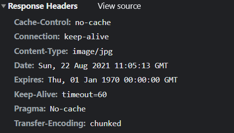

秒杀接口的隐藏

使用复杂验证码，考虑OCR识别技术

接口防刷：每个用户在m分钟最多能刷新n次

---


### 接口隐藏

思路：秒杀接口不进行暴露，向用户暴露获取秒杀接口的接口 `/seckill/path` ，需要用户主动获取，**秒杀接口个性化**，在秒杀前需要请求获取自己的秒杀接口 `/seckill/sadglajkgalsglasjoi/doSeckill3`


请求秒杀接口：

```java
@PostMapping(value = "/path")
@ResponseBody
public RespBean getSeckillPath(User user, Long goodsId) {

    if (null == user || null == goodsId)
        return RespBean.error(RespTypeEnum.REQUEST_ILLEGAL);

    //获取秒杀路径
    String path = orderService.createPath(user, goodsId);

    return RespBean.success(path);
}
```

秒杀接口：

```java
@PostMapping(value = "/{path}/doSeckill3")//路径拼接规则，path 是个性化的路径
@ResponseBody
public RespBean kill3(@PathVariable String path,
                      User user, @RequestParam("goodsId") Long goodsId) {
	...
}
```

服务接口隐藏的两个重要接口：

```java
/**
 * 创建秒杀接口
 *
 * @param user    用户信息
 * @param goodsId 商品信息
 * @return 用户 user 对于商品 goodsId 的秒杀路径，具有时效性
 */
@Override
public String createPath(User user, Long goodsId) {

    if (null == goodsId) throw new GlobalException(RespTypeEnum.GOODS_NOT_EXIST);

    String path = null;

    ValueOperations opsFV = redisTemplate.opsForValue();
    if (redisTemplate.hasKey("seckillPath:uid-" + user.getId() + ":gid-" + goodsId)) {
        path = (String) opsFV.get("seckillPath:uid-" + user.getId() + ":gid-" + goodsId);
    }
    if (null == path) {
        String uuid = UUIDUtil.uuid();
        path = MD5Util.md5(uuid + SEKILL_PATH_KEY);
        opsFV.set("seckillPath:uid-" + user.getId() + ":gid-" + goodsId, path,
                60, TimeUnit.SECONDS);
    }

    return path;
}

/**
 * 检查秒杀接口
 *
 * @param user    非null
 * @param goodsId 非null
 * @param path    非null
 * @return
 */
@Override
public Boolean checkPath(User user, Long goodsId, String path) {

    String pathFromRedis =
            (String) redisTemplate.opsForValue().get("seckillPath:uid-" + user.getId() + ":gid-" + goodsId);

    if (pathFromRedis == null) {
        return false;
    }

    return path.equals(pathFromRedis);
}
```

前端

```js
function getSeckillPath() {
    var goodsId = g_getQueryString("goodsId");
    //获取秒杀接口
    $.ajax({
        url: "/seckill/path",
        type: "POST",
        data: {
            "goodsId": goodsId
        },
        success: function (data) {
            if (data.code == 200) {
                doSeckill(goodsId, data.data)//获取秒杀路径后进行秒杀
            } else {
                layer.msg(data.msg)
            }
        },
        error: function () {
            layer.msg("秒杀失败~")
        }
    })
}

function doSeckill(goodsId, path) {
    $.ajax({
        url: '/seckill/' + path + '/doSeckill3/',
        data: {
            "goodsId": goodsId
        },
        type: 'POST',
        success: function (data) {
            if (data.code == 200) {
                getResult(goodsId)
            } else {
                layer.msg(data.msg)
            }
        },
        error: function () {
            layer.msg("秒杀失败~")
        }
    })

}
```

存在问题：外部人员 获取到后端的 path，并且直到拼接规则，可以获取真正的秒杀路径，还可能会有问题


### 使用验证码

OCR技术成熟，一般的数字、字母验证码可能会被电脑识别，需要使用 数学题、成语题来防范

```xml
<!--captcha组件-->
<dependency>
    <groupId>com.github.whvcse</groupId>
    <artifactId>easy-captcha</artifactId>
    <version>1.6.2</version>
</dependency>
```

获取验证码

```java
@GetMapping("/captcha")
public void captcha(User user, Long goodsId,
                    HttpServletResponse response) {

    if (null == user | goodsId == null)
        throw new GlobalException(RespTypeEnum.REQUEST_ILLEGAL);

    // 设置请求头为输出图片类型
    response.setContentType("image/jpg");
    response.setHeader("Pragma", "No-cache");
    response.setHeader("Cache-Control", "no-cache");
    response.setDateHeader("Expires", 0);

    // 算术类型
    ArithmeticCaptcha captcha = new ArithmeticCaptcha(130, 32);
    captcha.setLen(3);  // 几位数运算，默认是两位
    captcha.getArithmeticString();  // 获取运算的公式：3+2=?
    String res = captcha.text();// 获取运算的结果：5

    redisTemplate.opsForValue().set("captcha:uid-" + user.getId() + ":gid-" + goodsId,
            res, 60, TimeUnit.SECONDS);

    try {
        captcha.out(response.getOutputStream());  // 输出验证码
    } catch (IOException e) {
        //e.printStackTrace();
        log.info("获取验证码失败~");
    }

}
```



请求秒杀接口时，进行验证码校验

```java
@PostMapping(value = "/path")
@ResponseBody
public RespBean getSeckillPath(User user, Long goodsId, String captcha) {

    if (null == user || null == goodsId || !StringUtils.hasLength(captcha))
        return RespBean.error(RespTypeEnum.REQUEST_ILLEGAL);

    //校验验证码
    Integer check = orderService.checkCaptcha(user, goodsId, captcha);
    if (check == 1)
        return RespBean.error(RespTypeEnum.CAPTCHA_INVALID);
    else if (check == 2) {
        return RespBean.error(RespTypeEnum.CAPTCHA_ERROR);
    }

    //获取秒杀路径
    String path = orderService.createPath(user, goodsId);

    return RespBean.success(path);
}

==========================
    
@Override
public Integer checkCaptcha(User user, Long goodsId, String captcha) {

    String captcha0 = (String) redisTemplate.opsForValue().get("captcha:uid-" + user.getId() + ":gid-" + goodsId);

    //log.info("captcha = ", captcha, captcha0);

    if (captcha0 == null) return 1;//失效
    if (!captcha0.equals(captcha)) return 2;//错误
    return 3;//正确
}

```

前端代码

```js
function refreshCaptcha() {
    $('#captchaImg').show()
    $('#captcha').show()
    $('#captchaImg').attr("src", "/seckill/captcha?goodsId=" + $('#goodsId').val() + "&time=" + new Date().getTime()) // 添加时间戳，防止请求失效
}
```


**大体思路：**

1. 用户在规定时间内进行秒杀，此时调用**前端**的 `refreshCaptcha(goodsId, user_ticket)` 获取用户的算术验证码，其结果存放在 redis 中

2. 在点击秒杀按钮时，需要填入验证码需要的结果，此时前端调用后端接口 `/seckill/path` 需要携带 **goodsId、验证码、cookie**
3. 后端在**获取秒杀接口** `/seckill/xxxxx/doSeckill3` 前需要验证验证码，此时用户的验证码可能失效或者错误，后端需要返回给前端

**效果：**

用户需要输入验证码才能进行秒杀，用户输入的快慢不同，可以将请求分散到更长的时间，这样子每一秒的请求就降低了


### 限流

在一定时间段内，限制用户访问次数


