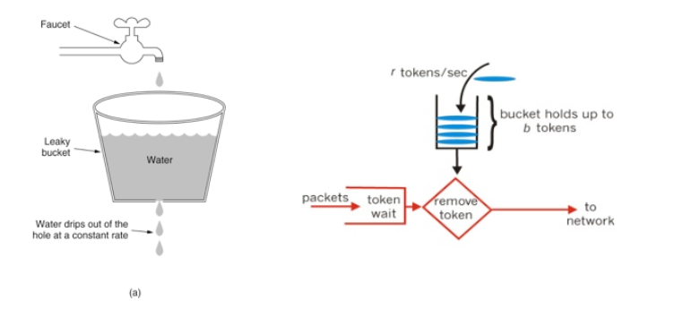

秒杀接口的隐藏

使用复杂验证码，考虑OCR识别技术

接口防刷：每个用户在m分钟最多能刷新n次

---


### 接口隐藏

思路：秒杀接口不进行暴露，向用户暴露获取秒杀接口的接口 `/seckill/path` ，需要用户主动获取，**秒杀接口个性化**，在秒杀前需要请求获取自己的秒杀接口 `/seckill/sadglajkgalsglasjoi/doSeckill3`


请求秒杀接口：

```java
@PostMapping(value = "/path")
@ResponseBody
public RespBean getSeckillPath(User user, Long goodsId) {

    if (null == user || null == goodsId)
        return RespBean.error(RespTypeEnum.REQUEST_ILLEGAL);

    //获取秒杀路径
    String path = orderService.createPath(user, goodsId);

    return RespBean.success(path);
}
```

秒杀接口：

```java
@PostMapping(value = "/{path}/doSeckill3")//路径拼接规则，path 是个性化的路径
@ResponseBody
public RespBean kill3(@PathVariable String path,
                      User user, @RequestParam("goodsId") Long goodsId) {
	...
}
```

服务接口隐藏的两个重要接口：

```java
/**
 * 创建秒杀接口
 *
 * @param user    用户信息
 * @param goodsId 商品信息
 * @return 用户 user 对于商品 goodsId 的秒杀路径，具有时效性
 */
@Override
public String createPath(User user, Long goodsId) {

    if (null == goodsId) throw new GlobalException(RespTypeEnum.GOODS_NOT_EXIST);

    String path = null;

    ValueOperations opsFV = redisTemplate.opsForValue();
    if (redisTemplate.hasKey("seckillPath:uid-" + user.getId() + ":gid-" + goodsId)) {
        path = (String) opsFV.get("seckillPath:uid-" + user.getId() + ":gid-" + goodsId);
    }
    if (null == path) {
        String uuid = UUIDUtil.uuid();
        path = MD5Util.md5(uuid + SEKILL_PATH_KEY);
        opsFV.set("seckillPath:uid-" + user.getId() + ":gid-" + goodsId, path,
                60, TimeUnit.SECONDS);
    }

    return path;
}

/**
 * 检查秒杀接口
 *
 * @param user    非null
 * @param goodsId 非null
 * @param path    非null
 * @return
 */
@Override
public Boolean checkPath(User user, Long goodsId, String path) {

    String pathFromRedis =
            (String) redisTemplate.opsForValue().get("seckillPath:uid-" + user.getId() + ":gid-" + goodsId);

    if (pathFromRedis == null) {
        return false;
    }

    return path.equals(pathFromRedis);
}
```

前端

```js
function getSeckillPath() {
    var goodsId = g_getQueryString("goodsId");
    //获取秒杀接口
    $.ajax({
        url: "/seckill/path",
        type: "POST",
        data: {
            "goodsId": goodsId
        },
        success: function (data) {
            if (data.code == 200) {
                doSeckill(goodsId, data.data)//获取秒杀路径后进行秒杀
            } else {
                layer.msg(data.msg)
            }
        },
        error: function () {
            layer.msg("秒杀失败~")
        }
    })
}

function doSeckill(goodsId, path) {
    $.ajax({
        url: '/seckill/' + path + '/doSeckill3/',
        data: {
            "goodsId": goodsId
        },
        type: 'POST',
        success: function (data) {
            if (data.code == 200) {
                getResult(goodsId)
            } else {
                layer.msg(data.msg)
            }
        },
        error: function () {
            layer.msg("秒杀失败~")
        }
    })

}
```

存在问题：外部人员 获取到后端的 path，并且直到拼接规则，可以获取真正的秒杀路径，还可能会有问题


### 使用验证码

OCR技术成熟，一般的数字、字母验证码可能会被电脑识别，需要使用 数学题、成语题来防范

```xml
<!--captcha组件-->
<dependency>
    <groupId>com.github.whvcse</groupId>
    <artifactId>easy-captcha</artifactId>
    <version>1.6.2</version>
</dependency>
```

获取验证码

```java
@GetMapping("/captcha")
public void captcha(User user, Long goodsId,
                    HttpServletResponse response) {

    if (null == user | goodsId == null)
        throw new GlobalException(RespTypeEnum.REQUEST_ILLEGAL);

    // 设置请求头为输出图片类型
    response.setContentType("image/jpg");
    response.setHeader("Pragma", "No-cache");
    response.setHeader("Cache-Control", "no-cache");
    response.setDateHeader("Expires", 0);

    // 算术类型
    ArithmeticCaptcha captcha = new ArithmeticCaptcha(130, 32);
    captcha.setLen(3);  // 几位数运算，默认是两位
    captcha.getArithmeticString();  // 获取运算的公式：3+2=?
    String res = captcha.text();// 获取运算的结果：5

    redisTemplate.opsForValue().set("captcha:uid-" + user.getId() + ":gid-" + goodsId,
            res, 60, TimeUnit.SECONDS);

    try {
        captcha.out(response.getOutputStream());  // 输出验证码
    } catch (IOException e) {
        //e.printStackTrace();
        log.info("获取验证码失败~");
    }

}
```


请求秒杀接口时，进行验证码校验

```java
@PostMapping(value = "/path")
@ResponseBody
public RespBean getSeckillPath(User user, Long goodsId, String captcha) {

    if (null == user || null == goodsId || !StringUtils.hasLength(captcha))
        return RespBean.error(RespTypeEnum.REQUEST_ILLEGAL);

    //校验验证码
    Integer check = orderService.checkCaptcha(user, goodsId, captcha);
    if (check == 1)
        return RespBean.error(RespTypeEnum.CAPTCHA_INVALID);
    else if (check == 2) {
        return RespBean.error(RespTypeEnum.CAPTCHA_ERROR);
    }

    //获取秒杀路径
    String path = orderService.createPath(user, goodsId);

    return RespBean.success(path);
}

==========================
    
@Override
public Integer checkCaptcha(User user, Long goodsId, String captcha) {

    String captcha0 = (String) redisTemplate.opsForValue().get("captcha:uid-" + user.getId() + ":gid-" + goodsId);

    //log.info("captcha = ", captcha, captcha0);

    if (captcha0 == null) return 1;//失效
    if (!captcha0.equals(captcha)) return 2;//错误
    return 3;//正确
}

```

前端代码

```js
function refreshCaptcha() {
    $('#captchaImg').show()
    $('#captcha').show()
    $('#captchaImg').attr("src", "/seckill/captcha?goodsId=" + $('#goodsId').val() + "&time=" + new Date().getTime()) // 添加时间戳，防止请求失效
}
```


**大体思路：**

1. 用户在规定时间内进行秒杀，此时调用**前端**的 `refreshCaptcha(goodsId, user_ticket)` 获取用户的算术验证码，其结果存放在 redis 中

2. 在点击秒杀按钮时，需要填入验证码需要的结果，此时前端调用后端接口 `/seckill/path` 需要携带 **goodsId、验证码、cookie**
3. 后端在**获取秒杀接口** `/seckill/xxxxx/doSeckill3` 前需要验证验证码，此时用户的验证码可能失效或者错误，后端需要返回给前端

**效果：**

用户需要输入验证码才能进行秒杀，用户输入的快慢不同，可以将请求分散到更长的时间，这样子每一秒的请求就降低了


### 限流

在一定时间段内，限制用户访问次数

简单的限流：**计数器法**

```java
@PostMapping(value = "/path")
@ResponseBody
public RespBean getSeckillPath(User user, Long goodsId, String captcha,
                               HttpServletRequest request) {

    if (null == user || null == goodsId || !StringUtils.hasLength(captcha))
        return RespBean.error(RespTypeEnum.REQUEST_ILLEGAL);

    //检测接口访问频率
	String key = request.getRequestURI() + ":uid-" + user.getId();
    Integer count = (Integer) redisTemplate.opsForValue().get(key);
    if (null == count) {
        redisTemplate.opsForValue().set(key, 0, 5, TimeUnit.SECONDS);
    } else if (count < 5) {
        redisTemplate.opsForValue().increment(key);//自增时变量时效性不受影响
    } else
        return RespBean.error(RespTypeEnum.ACCESS_LIMIT_REACHED);

    //校验验证码
    Integer check = orderService.checkCaptcha(user, goodsId, captcha);
    if (check == 1)
        return RespBean.error(RespTypeEnum.CAPTCHA_INVALID);
    else if (check == 2) {
        return RespBean.error(RespTypeEnum.CAPTCHA_ERROR);
    }

    //获取秒杀路径
    String path = orderService.createPath(user, goodsId);

    return RespBean.success(path);
}
```

问题：临界问题，周期性压力；浪费资源


**漏桶算法和令牌桶算法**

> 
>
> - 漏斗算法：漏桶算法思路很简单，水(请求）先进入到漏桶里，漏桶以一定的速度出水，当水流入速度过大会直接溢出，可以看出漏桶算法能强行限制数据的传输速率。
> - 令牌桶算法：最初来源于计算机网络。在网络传输数据时，为了防止网络拥塞，需限制流出网络的流量，使流量以比较均匀的速度向外发送。令牌桶算法就实现了这个功能，可控制发送到网络上数据的数目，并允许突发数据的发送。大小固定的令牌桶可自行以恒定的速率源源不断地产生令牌。如果令牌不被消耗，或者被消耗的速度小于产生的速度，令牌就会不断地增多，`直到把桶填满`。后面再产生的令牌就会从桶中`溢出`。最后桶中可以保存的最大令牌数永远不会超过桶的大小。这意味，面对瞬时大流量，该算法可以在短时间内请求拿到大量令牌，而且拿令牌的过程并不是消耗很大的事情。


**通用的 接口限流**

上边实现的 计数器限流方法

```java
@PostMapping(value = "/path")
@ResponseBody
public RespBean getSeckillPath(User user, Long goodsId, String captcha,
                               HttpServletRequest request) {

    if (null == user || null == goodsId || !StringUtils.hasLength(captcha))
        return RespBean.error(RespTypeEnum.REQUEST_ILLEGAL);

///////////////////////////代码重复，且不方便修改
    String key = request.getRequestURI() + ":uid-" + user.getId();

    Integer count = (Integer) redisTemplate.opsForValue().get(key);
    if (null == count) {
        redisTemplate.opsForValue().set(key, 0, 5, TimeUnit.SECONDS);
    } else if (count < 5) {
        redisTemplate.opsForValue().increment(key);//自增时变量失效性不受影响
    } else
        return RespBean.error(RespTypeEnum.ACCESS_LIMIT_REACHED);
///////////////////////////
    
    //校验验证码
    Integer check = orderService.checkCaptcha(user, goodsId, captcha);
    if (check == 1)
        return RespBean.error(RespTypeEnum.CAPTCHA_INVALID);
    else if (check == 2) {
        return RespBean.error(RespTypeEnum.CAPTCHA_ERROR);
    }

    //获取秒杀路径
    String path = orderService.createPath(user, goodsId);

    return RespBean.success(path);
}
```

问题：代码重复，并且不方便修改

很多场景下都有接口的限流的需要，此时可以使用**通用**的限流功能

思路：

1. 自定义注解 **@AccessLimit** ，用来描述请求接口的限流信息
2. 使用拦截器，拦截每个请求，尝试获取已登录的信息，放入 **threadLocal**
3. 判断每个请求方法是否使用 **@AccessLimit** 标记，如果使用了进而判断是否要求登录和访问频率

问题：

- 后边还想要使用用户信息怎么办？直接从 threadLocal 中拿


threaLocal 存放一次请求的用户信息

```java
/**
 * 存放用户信息，在 AccessLimitInterceptor 中预处理
 */
public class UserContext {

    private static final ThreadLocal<User> threadLocal = new ThreadLocal<>();

    public static void set(User user) {
        threadLocal.set(user);
    }

    public static User get() {
        return threadLocal.get();
    }

}
```

定义限流注解

```java
@Retention(RetentionPolicy.RUNTIME)
@Target(ElementType.METHOD)
public @interface AccessLimit {

    //次数
    int count();

    //多长时间内
    int seconds();

    //是否需要登录
    boolean needLogin() default true;
}
```

使用限流注解

```java
@AccessLimit(seconds = 5, count = 5, needLogin = true)
@PostMapping(value = "/path")
@ResponseBody
public RespBean getSeckillPath(User user, Long goodsId, String captcha,
                               HttpServletRequest request) {

    if (null == user || null == goodsId || !StringUtils.hasLength(captcha))
        return RespBean.error(RespTypeEnum.REQUEST_ILLEGAL);

    //使用 @AccessLimit 进行拦截判断：更加通用
    /*String key = request.getRequestURI() + ":uid-" + user.getId();

    Integer count = (Integer) redisTemplate.opsForValue().get(key);
    if (null == count) {
        redisTemplate.opsForValue().set(key, 0, 5, TimeUnit.SECONDS);
    } else if (count < 5) {
        redisTemplate.opsForValue().increment(key);//自增时变量失效性不受影响
    } else
        return RespBean.error(RespTypeEnum.ACCESS_LIMIT_REACHED);*/

    //校验验证码
    Integer check = orderService.checkCaptcha(user, goodsId, captcha);
    if (check == 1)
        return RespBean.error(RespTypeEnum.CAPTCHA_INVALID);
    else if (check == 2) {
        return RespBean.error(RespTypeEnum.CAPTCHA_ERROR);
    }

    //获取秒杀路径
    String path = orderService.createPath(user, goodsId);

    return RespBean.success(path);
}
```

定义拦截器

```java
@Component
public class AccessLimitInterceptor implements HandlerInterceptor {

    @Autowired
    private IUserService userService;

    @Autowired
    private RedisTemplate redisTemplate;

    /**
     * 1）拦截每个请求，解析请求，将用户信息放入 UseContext 的 threadlocal 中 </br>
     * 2）判断接口是否需要登陆，如果需要登陆则进行限流 </br>
     * 如何对不需要登陆的接口进行限流？
     *
     * @param request
     * @param response
     * @param handler
     * @return
     * @throws IOException
     */
    @Override
    public boolean preHandle(HttpServletRequest request, HttpServletResponse response, Object handler) throws IOException {

        if (handler instanceof HandlerMethod) {

            HandlerMethod hm = (HandlerMethod) handler;
            AccessLimit accessLimit = hm.getMethodAnnotation(AccessLimit.class);
            
            User user = getUserByRequest(request, response);
            UserContext.set(user);
            
            //方法没有使用 AccessLimit 标记
            //需要在此之前获取用户信息
            if (accessLimit == null) return false;

            int count = accessLimit.count();
            int seconds = accessLimit.seconds();
            boolean needLogin = accessLimit.needLogin();

            String requestURI = request.getRequestURI();

            //需要登陆
            if (needLogin) {
                String key;
                if (user == null) {
                    render(response, RespBean.error(RespTypeEnum.SESSION_NOT_EXIST));
                    return false;
                } else {
                    key = requestURI + ":uid-" + user.getId();
                }

                //检查访问频率
                Integer count0 = (Integer) redisTemplate.opsForValue().get(key);
                if (null == count0) {
                    redisTemplate.opsForValue().set(key, 0, seconds, TimeUnit.SECONDS);
                } else if (count0 < count) {
                    redisTemplate.opsForValue().increment(key);
                } else {
                    render(response, RespBean.error(RespTypeEnum.ACCESS_LIMIT_REACHED));
                    return false;
                }
            }
            //对不需要登陆的接口不进行限制

            return true;
        }
        return false;
    }

    /**
     * 写入响应 RespBean，代替 @ResponseBody + 返回 RespBean
     *
     * @param response
     * @param error
     * @throws IOException
     */
    private void render(HttpServletResponse response, RespBean error) throws IOException {
        response.setContentType("application/json");
        response.setCharacterEncoding("UTF-8");
        PrintWriter writer = response.getWriter();
        writer.write(JsonUtil.object2JsonStr(error));
        writer.flush();
        writer.close();
    }

    /**
     * 获取登录信息
     *
     * @param request
     * @param response
     * @return
     */
    private User getUserByRequest(HttpServletRequest request, HttpServletResponse response) {

        String ticket = CookieUtil.getCookieValue(request, "user_ticket");

        if (StringUtils.hasLength(ticket)) {
            return userService.getUserInfoByTicket(request, response, ticket);
        }

        return null;
    }
}
```

WebMvcConfigurer 中添加配置

```java
@Override
public void addInterceptors(InterceptorRegistry registry) {
    registry.addInterceptor(accessLimitInterceptor);
}
```

参数解析

```java
@Component
public class UserArgumentResolver implements HandlerMethodArgumentResolver {

    @Autowired
    private IUserService userService;


    @Override
    public boolean supportsParameter(MethodParameter parameter) {
        return parameter.getParameterType() == User.class;
    }

    @Override
    public Object resolveArgument(MethodParameter parameter, ModelAndViewContainer mavContainer, NativeWebRequest webRequest, WebDataBinderFactory binderFactory) throws Exception {
        return UserContext.get();//从threadlocal中拿
    }
}
```


### 安全优化 · 总结

0、前端优化不保险

1、接口地址隐藏，秒杀时需要获取真正的秒杀地址，可以防止一部分人

2、加入复杂的验证码（OCR技术的成熟），另一方面可以分散秒杀前几秒的压力

3、接口限流，有计数器算法、令牌桶算法、漏桶算法。使用拦截器做限流优化


